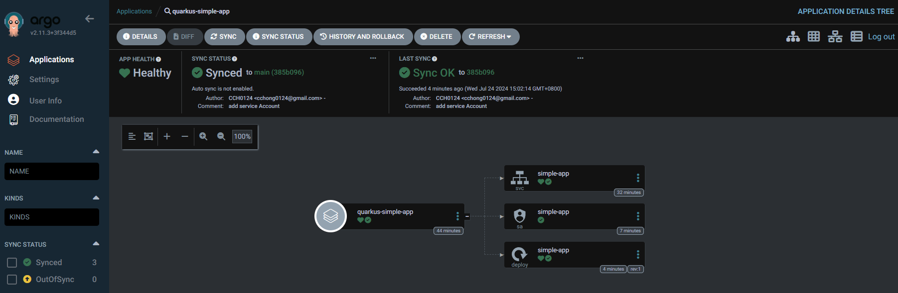

## Lab1
1. Create Repositories
1. Create application [simple-app](https://github.com/CCH0124/K8s-with-quarkus/tree/main/application-simple/simple-app)
2. Kubernetes YAML
3. Deploy application to dev cluster
4. Try different sync mode
5. Update git repo(Helm/application)


### Create Repository
要讓 ArgoCD 能夠實現 GitOps 的流程，必定要有一個 Repository，而 ArgoCD 的 Repository 由以下定義。

- Type (表示 Repository 類型)
  - Git
  - Helm
  - etc.
- URL (Repository URL)
- Username (存取 Repository 的帳號)
- Password (存取 Repository 的密碼)
- TLS (是否為經過 TLS)

透過 `repo add` 指令新增 Repository 來源，指向放置 Kubernetes 部署檔案位置。當中 `--project`，選擇系統預設建立的 `default`，該物件負責做 RBAC 的應用功能或是存取 Kubernetes 存取控管。

```bash
$ argocd repo add --name app https://github.com/CCH0124/K8s-with-quarkus.git --type git --project default
Repository 'https://github.com/CCH0124/K8s-with-quarkus.git' added
```

從以下 `proj list` 指令可以看到該 `default` 物件。再 `DESTINATIONS` 中可以針對 `Cluster` 和 `namespece` 進行設定。

```bash
$ argocd proj list
NAME     DESCRIPTION  DESTINATIONS  SOURCES  CLUSTER-RESOURCE-WHITELIST  NAMESPACE-RESOURCE-BLACKLIST  SIGNATURE-KEYS  ORPHANED-RESOURCES
default               *,*           *        */*                         <none>                        <none>          disabled
```

借由 `repo list` 查看 `STATUS` 欄位是否有成功存取。

```bash
$ argocd repo list
TYPE  NAME  REPO                                             INSECURE  OCI    LFS    CREDS  STATUS      MESSAGE  PROJECT
git   app   https://github.com/CCH0124/K8s-with-quarkus.git  false     false  false  false  Successful           default
```

假設想要讓此 `simple-app` 只能部署至 `dev` 環境的 `team-a` namespace，和限制可以在 namespace 存取的資源。可以設定該 `Project`，這邊會建立一個給 `team-a` 的 `Project`，建立方式如下。

```bash
argocd proj create team-a --src=https://github.com/CCH0124/K8s-with-quarkus.git --dest=https://172.18.0.6:6443,team-a  --description="for dev" --allow-namespaced-resource=*/Service --allow-namespaced-resource=apps/Deployment
```

建立完成後透過  `proj get {PROJECT_NAME}` 是要可以看到建立的內容。

```bash
$ argocd proj get team-a
Name:                        team-a
Description:                 for dev
Destinations:                https://172.18.0.6:6443,team-a
Repositories:                https://github.com/CCH0124/K8s-with-quarkus.git
Scoped Repositories:         <none>
Allowed Cluster Resources:   <none>
Scoped Clusters:             <none>
Denied Namespaced Resources: <none>
Signature keys:              <none>
Orphaned Resources:          disabled
```

建立完成後往下一步，可以建立第一個給 ArgoCD 管理的應用程式。

[ArgoCD | projects](https://argo-cd.readthedocs.io/en/stable/user-guide/projects/)
[ArgoCD | CLI | argocd_proj_create](https://argo-cd.readthedocs.io/en/release-2.11/user-guide/commands/argocd_proj_create/)

### Create Application

當有了 `Repositories` 接著就是告訴 ArgoCD 要部署應用程式。而應用程式由以下組成

- General
  - Name
  - Project
  - Sync Policy
- Source
  - Repository
  - Revision
    - Branch/Tag
  - Path
- Destination
  - Cluster Url/Cluster name
  - namespace

```bash
$ argocd app create quarkus-simple-app --project=team-a --sync-policy=manual --set-finalizer --repo https://github.com/CCH0124/K8s-with-quarkus.git --path=application-simple/simple-app/kubernetes --revision=main --dest-name=k3d-dev-cluster --dest-namespa
ce=team-a --directory-recurse --directory-exclude=*.json
application 'quarkus-simple-app' created
```
關於參數，
- `--repo` 選擇一開始要監控的 Repo
- `--revision` 選擇遠方 Repo 的分支這邊使用 main
- `--path` 遠方 Repo 下的目錄，這邊是該 Repo 下 Kubernetes YAML 檔案
- `--dest-name` 指定部署的 Kubernetes 集群
- `--directory-recurse` 遞規目錄
- `--directory-exclude` 排除路徑
- `--sync-policy` 同步政策
- `--project` 綁定的 `Project`


接下去是佈署的目標這邊選擇 k3d 所建立的 dev 集群環境，namespace 這邊使用 `dev`

建立完成後至 ArgoCD 平台可以看到建立的 Application，改狀態要為 `OutOfSync`，因為 `--sync-policy` 設定為手動 (manual)。透過 `argocd app sync` 方式讓其進行同步，但會發現有錯誤，因為在範例的 YAML 它部署目的是 default 的 `namespace` 被 team-a 的 `Project` 擋掉。

```bash
$ argocd app sync argo/quarkus-simple-app
TIMESTAMP                  GROUP        KIND   NAMESPACE                  NAME    STATUS    HEALTH        HOOK  MESSAGE
2024-07-24T14:26:02+08:00   apps  Deployment     default            simple-app  OutOfSync  Missing              namespace default is not permitted in project 'team-a'
2024-07-24T14:26:02+08:00            Service     default            simple-app  OutOfSync  Missing              namespace default is not permitted in project 'team-a'

Name:               argo/quarkus-simple-app
Project:            team-a
Server:             k3d-dev-cluster
Namespace:          team-a
URL:                https://argo.cch.com/applications/argo/quarkus-simple-app
Source:
- Repo:             https://github.com/CCH0124/K8s-with-quarkus.git
  Target:           main
  Path:             application-simple/simple-app/kubernetes
SyncWindow:         Sync Allowed
Sync Policy:        Manual
Sync Status:        OutOfSync from main (8e010a7)
Health Status:      Missing

Operation:          Sync
Sync Revision:      8e010a7ce9c1a8cbcf978d9cc80756e59e70466f
Phase:              Failed
Start:              2024-07-24 14:26:01 +0800 CST
Finished:           2024-07-24 14:26:01 +0800 CST
Duration:           0s
Message:            one or more synchronization tasks are not valid

GROUP  KIND        NAMESPACE  NAME        STATUS     HEALTH   HOOK  MESSAGE
apps   Deployment  default    simple-app  OutOfSync  Missing        namespace default is not permitted in project 'team-a'
       Service     default    simple-app  OutOfSync  Missing        namespace default is not permitted in project 'team-a'
FATA[0001] Operation has completed with phase: Failed
```


被擋掉的 Kubernetes YAML，`namespace` 的欄位為 default，因此需要將其替換成 `team-a`

```yaml
---
apiVersion: v1
kind: Service
metadata:
  annotations:
    app.quarkus.io/quarkus-version: 3.12.3
    app.quarkus.io/commit-id: 18b38d579079f66b394f747aa55dd0b44b904fe8
    app.quarkus.io/vcs-uri: https://github.com/CCH0124/K8s-with-quarkus.git
    app.quarkus.io/build-timestamp: 2024-07-24 - 04:55:05 +0000
  labels:
    app.kubernetes.io/name: simple-app
    app.kubernetes.io/version: 1.0.0-SNAPSHOT
    app.kubernetes.io/managed-by: quarkus
  name: simple-app
  namespace: default
spec:
  ports:
    - name: http
      port: 80
      protocol: TCP
      targetPort: 8080
  selector:
    app.kubernetes.io/name: simple-app
    app.kubernetes.io/version: 1.0.0-SNAPSHOT
  type: ClusterIP
```

進行變更後，再進行一次同步，會看見服務有正常被同步，但實際 Kubernetes 資源服務尚未部署成功。原因是為新增 `ServiceAccount` 資源。

```bash
$ argocd app sync argo/quarkus-simple-app
TIMESTAMP                  GROUP        KIND   NAMESPACE                  NAME    STATUS    HEALTH        HOOK  MESSAGE
2024-07-24T14:34:24+08:00            Service      team-a            simple-app  OutOfSync  Missing
2024-07-24T14:34:24+08:00   apps  Deployment      team-a            simple-app  OutOfSync  Missing
2024-07-24T14:34:24+08:00            Service      team-a            simple-app  OutOfSync  Missing              service/simple-app created
2024-07-24T14:34:24+08:00   apps  Deployment      team-a            simple-app  OutOfSync  Missing              deployment.apps/simple-app created
2024-07-24T14:34:24+08:00            Service      team-a            simple-app    Synced  Healthy              service/simple-app created

Name:               argo/quarkus-simple-app
Project:            team-a
Server:             k3d-dev-cluster
Namespace:          team-a
URL:                https://argo.cch.com/applications/argo/quarkus-simple-app
Source:
- Repo:             https://github.com/CCH0124/K8s-with-quarkus.git
  Target:           main
  Path:             application-simple/simple-app/kubernetes
SyncWindow:         Sync Allowed
Sync Policy:        Manual
Sync Status:        Synced to main (c7a9761)
Health Status:      Progressing

Operation:          Sync
Sync Revision:      c7a9761e3d5bd281d2e514abc58e170da6447caf
Phase:              Succeeded
Start:              2024-07-24 14:34:24 +0800 CST
Finished:           2024-07-24 14:34:24 +0800 CST
Duration:           0s
Message:            successfully synced (all tasks run)

GROUP  KIND        NAMESPACE  NAME        STATUS  HEALTH       HOOK  MESSAGE
       Service     team-a     simple-app  Synced  Healthy            service/simple-app created
apps   Deployment  team-a     simple-app  Synced  Progressing        deployment.apps/simple-app create
```

下面宣告了 `ServiceAccount` 資源。

```yaml
apiVersion: v1
kind: ServiceAccount
metadata:
  labels:
    app.kubernetes.io/managed-by: devops
    app.kubernetes.io/name: simple-app
    app.kubernetes.io/version: 1.0.0-SNAPSHOT
  name: simple-app
  namespace: team-a
```

宣告 `ServiceAccount` 後在同步一次，發現 `ServiceAccount is not permitted in project team-a` 這表示 `ServiceAccount` 資源被 team-a 的 `Project` 拒絕。對於 team-a 的 `Project`，只允許 `Service` 和 `Deployment` 資源可被開發端使用。

```bash
$ argocd app sync argo/quarkus-simple-app

Name:               argo/quarkus-simple-app
Project:            team-a
Server:             k3d-dev-cluster
Namespace:          team-a
....
GROUP  KIND            NAMESPACE  NAME        STATUS   HEALTH       HOOK  MESSAGE
       ServiceAccount  team-a     simple-app  Unknown  Missing            resource :ServiceAccount is not permitted in project team-a
       Service         team-a     simple-app  Synced   Healthy
apps   Deployment      team-a     simple-app  Synced   Progressing
FATA[0000] Operation has completed with phase: Failed
```

為了讓開發端能夠使用 `ServiceAccount` 必須更改 team-a 的 `Project` 資源。

```bash
$ argocd proj set team-a --allow-namespaced-resource=*/ServiceAccount --allow-namespaced-resource=*/Service --allow-namespaced-resource=apps/Deployment
```

然而，在 ArgoCD 平台 Application 上，可以如下看到資源狀態。



透過 `app get` 指令，可以看到當前部署上去的應用程式狀態。像是 `Health Status` 健康狀態、部署至哪個 Kubernetes 集群等。

```bash
$ argocd app get argo/quarkus-simple-app
Name:               argo/quarkus-simple-app
Project:            team-a
Server:             k3d-dev-cluster
Namespace:          team-a
URL:                https://argo.cch.com/applications/quarkus-simple-app
Source:
- Repo:             https://github.com/CCH0124/K8s-with-quarkus.git
  Target:           main
  Path:             application-simple/simple-app/kubernetes
SyncWindow:         Sync Allowed
Sync Policy:        Manual
Sync Status:        Synced to main (385b096)
Health Status:      Healthy

GROUP  KIND            NAMESPACE  NAME        STATUS  HEALTH   HOOK  MESSAGE
       ServiceAccount  team-a     simple-app  Synced                 serviceaccount/simple-app unchanged
       Service         team-a     simple-app  Synced  Healthy        service/simple-app unchanged
apps   Deployment      team-a     simple-app  Synced  Healthy        deployment.apps/simple-app created
```

那這邊應該會覺得奇怪，怎看不到 `ReplicaSet` 和 `Pod` 資源，原因其實也是 `Project` 資源設定問題，進行資源上的更改，其 ArgoCD 平台資源就可以存取，即新增資源存取權限，注意這邊 Kubernetes 環境是有把資源建立起來。

- apps/ReplicaSet 
- */Pod

到這邊基本上可以透過 ArgoCD 建立一個應用程式讓 ArgoCD 管理。下面部分會針對 ArgoCD 的 Application 進行探討。

### Sync Policy

當 ArgoCD 偵測到 Git 中所需的 Kubernetes YAML 與 Kubernetes 資源中的即時狀態之間的差異時，它能夠自動同步 Application。優勢是對於持續部署時能夠不必直接與 ArgoCD API 進行交互，制只需要將 YAML 檔的變化提交至 Git 儲存庫即可。但處於已同步或錯誤狀態的應用程式不會嘗試自動同步。

以下是 Automated Sync (自動同步)特性，對於本篇範例是使用手動，但讀者可以使用自動同步

- 每三分鐘輪循一次 Git 儲存庫
  - `timeout.reconciliation` 值可來變更設定
- Automatic pruning(自動修剪)
  - 安全機制，預設下當 Argo CD 偵測到資源不再 Git 中定義時，自動同步不會刪除資源
  - 要將不再使用資源進行移除時，可以手動進行同步並選擇修剪 (prune)
- Automatic Allow-Empty(允許空資源)
- Automatic Self-Healing(自動修復)
  - 對於 ArgoCD 所管理的 Kubernete 集群的資源所做的變更不會觸發自動同步
  - 預設 5 秒再同步一次

這邊有一個重點，無法對啟用了自動同步的應用程式執行回滾。也就是 ArgoCD 中對於 Application 資源的歷史紀錄不會記錄。

[ArgoCD | Automated Sync Policy](https://argo-cd.readthedocs.io/en/stable/user-guide/auto_sync/)

上述提到是自動同步，但在 ArgoCD 平台上是允許選擇性同步，也就是可以選擇某個資源，可能是 `Service` 或是 `ServiceAccount` 等。

為了將 ArgoCD 的 Application 資源變動為自動同步且帶有自動修復配置，可藉由 `app set` 指令如下配置。
```bash
$ argocd app set argo/quarkus-simple-app --sync-policy=automated  --self-heal
```

透過 `app get` 加上 `-oyaml`(輸出 YAML 格式)，可以看到成功配置。

```bash
$ argocd app get argo/quarkus-simple-app  -oyaml | grep -A 10 "syncPolicy"
  ...
--
  syncPolicy:
    automated:
      selfHeal: true
...
```

現在假設一個場景，某個開發人員，手動對 Kubernetes 集群中的資源進行 `scale` 的動作。但因為 `selfHeal` 的關係而禁止了該開發人員的臨時變動，演示如下。

1. 切換至 k3d-dev-cluster 環境
```bash
$ kubectl config use-context k3d-dev-cluster
```

2. 手動對 team-a `namespace` 中的 Pod 數量進行 `scale`

```bash
$ kubectl -n team-a scale deployment simple-app --replicas 3
```

3. 被 ArgoCD 的策略約束，擴展後被移除。這某方面保護了，非法存取的動作

```bash
$ kubectl -n team-a get pods -w
NAME                          READY   STATUS    RESTARTS   AGE
simple-app-77d8b45846-d27v8   1/1     Running   0          8h
simple-app-77d8b45846-h6gsj   0/1     Pending   0          0s
simple-app-77d8b45846-mkl4k   0/1     Pending   0          0s
simple-app-77d8b45846-h6gsj   0/1     Pending   0          0s
simple-app-77d8b45846-mkl4k   0/1     Pending   0          0s
simple-app-77d8b45846-h6gsj   0/1     ContainerCreating   0          0s
simple-app-77d8b45846-mkl4k   0/1     ContainerCreating   0          0s
simple-app-77d8b45846-h6gsj   0/1     Terminating         0          0s
simple-app-77d8b45846-mkl4k   0/1     Terminating         0          0s
simple-app-77d8b45846-mkl4k   0/1     Terminating         0          2s
simple-app-77d8b45846-mkl4k   0/1     Terminating         0          2s
simple-app-77d8b45846-mkl4k   0/1     Terminating         0          2s
simple-app-77d8b45846-h6gsj   0/1     Terminating         0          2s
simple-app-77d8b45846-h6gsj   0/1     Terminating         0          2s
simple-app-77d8b45846-h6gsj   0/1     Terminating         0          2s
```

### Health status

- Healthy 
  - 表示當前應用程式是健康
- Progressing 
  - 資源未處於健康即資源存在部分問題可能還在被編排，但仍在持續進行同步中，可能等一下就會是健康狀態
- Degraded 
  - 資源未滿足到指定狀態，可能是資源配置錯誤、資源部署失敗
- Suspended 
  - 資源暫停，等待外部事件恢復。例如：暫停的 `CronJob` 或暫停的 `Deployment`

對於 ArgoCD 來說健康狀態是可以自行定義，透過 [resource.customizations](https://argo-cd.readthedocs.io/en/stable/operator-manual/health/#way-1-define-a-custom-health-check-in-argocd-cm-configmap) 配置。

### Sync Status

基本上 ArgoCD 提供以下的同步狀態

- Synced
  - 表示 Git 中管理的資源與 Kubernetes 集群中的實際資源狀態完全一致，最理想的狀態
- OutOfSync
  - 表示 Git 中管理的資源與 Kubernetes 集群中的實際資源狀態不一致
- Unknown
  - 表示 ArgoCD 無法確定 Application 資源的當前狀態。可能是 ArgoCD 無法存取 Kubernetes 集群或資源定義存在錯誤
- Progressing
  - 表示 ArgoCD 正在同步 Application 資源，需要一些時間，取決於資源的複雜性和集群的規模
- Failed
  - 表示 ArgoCD 在同步 Application 資源時遇到錯誤


ArgoCD 平台上對於管理資源也能夠紀錄說當前狀態是誰進行提交，提交內容是什麼，這讓整個管理人員，有一個可稽核和追查的依據。 

