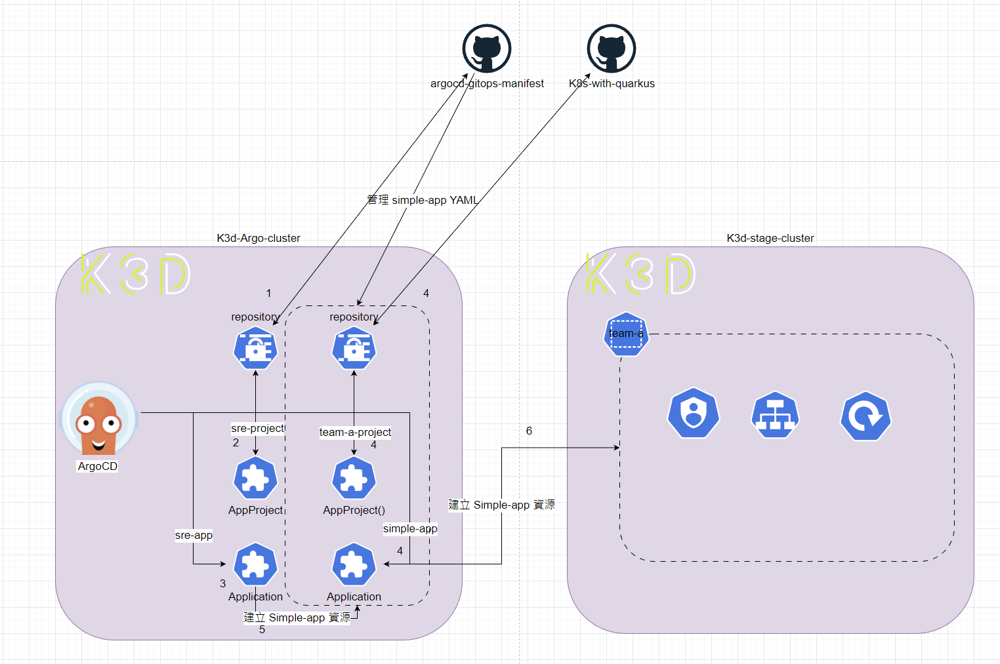

## Lab2
1. 聲明式設定
2. 範例 ArgoCD Project、Application、Repositories、Cluster 資源
3. Self-Managed ArgoCD 
4. Sync Option


## Declarative 宣告式聲明

在 Lab1 透過了 ArgoCD CLI 方式進行資源上的建置。實際上 ArgoCD 允許使用 Kubernetes YAML 並以聲明方式定義資源像是 Project、Application 等，這相較於指令可以設定的內容更豐富，使用上易於管理者管理。

下面範例會在 stage 環境進行建置，接著就慢慢探索 ArgoCD 的 CRD。

## 宣告式聲明範例

同樣的要透過 ArgoCD 在 stage 環境上要建置 [simple-app](https://github.com/CCH0124/K8s-with-quarkus/tree/main/application-simple/simple-app) 應用程式。流程會是

1. 建立 Project
2. 建立 Repositories
3. 建立 Application

### Project 

Project 是應用程式邏輯分組的 Kubernetes 資源物件。關鍵的配置有以下
- sourceRepos 提取像是 Kubernetes YAML 檔案的儲存庫
- destinations 應用程式可以部署到的 Kubernetes 和 namespace
- roles 資源存取權限的定義

下面定義了一個 `AppProject` CRD 資源，用於建立 `Project`。
```yaml
apiVersion: argoproj.io/v1alpha1
kind: AppProject
metadata:
  name: team-a-project
  namespace: argo
  # Finalizer that ensures that project is not deleted until it is not referenced by any application
  finalizers:
    - resources-finalizer.argocd.argoproj.io
spec:
  # 專案而外描述
  description: Project for team-a
  # 允許的 Git 儲存庫部署清單
  sourceRepos:
  - https://github.com/CCH0124/K8s-with-quarkus.git
  # 部署資源到 Kubernetes 的目的
  destinations:
  - namespace: team-a
    name: stage-cluster
  clusterResourceWhitelist:
  - group: ''
    kind: Namespace
  # namespace 範圍的資源白名單，非在白名單的一律拒絕存取
  namespaceResourceWhitelist:
  - group: 'apps'
    kind: Deployment
  - group: 'apps'
    kind: ReplicaSet
  - group: '*'
    kind: ServiceAccount
  - group: '*'
    kind: Service
  - group: '*'
    kind: Pod
  permitOnlyProjectScopedClusters: false
```

### Repositories

定義一個可讓 ArgoCD 平台存取的儲存庫清單。ArgoCD 沒有特別的 CRD 資源來宣告，而是使用 `argocd.argoproj.io/secret-type` 的標籤鍵值來識別。下面定義可以讓 ArgoCD 存取 `simple-app` 應用程式的出存庫。

實驗的 Git 儲存庫是公開的因此沒有機敏資訊，設定相對簡易。但對於有存取機敏資訊的要求可以整合第三方向是 Vault 或是 bitnami-labs/sealed-secrets 可以將機敏資訊做進一步安全處理。

```yaml
apiVersion: v1
kind: Secret
metadata:
  name: team-a-repo
  namespace: argo
  labels:
    argocd.argoproj.io/secret-type: repository
stringData:
  type: git
  url: https://github.com/CCH0124/K8s-with-quarkus.git
```


### Application

有了 Project 和 Repositories 接著定義要部署的資源 Application。比較重要的定義是

- project 要引用哪個 Project
- source 要同步儲存庫
- destination
- syncOption

```yaml
apiVersion: argoproj.io/v1alpha1
kind: Application
metadata:
  name: simple-app
  namespace: argo
  finalizers:
    - resources-finalizer.argocd.argoproj.io
  labels:
    name: simple-app
    environment: stage
spec:
  project: team-a-project
  source:
    repoURL: https://github.com/CCH0124/K8s-with-quarkus.git
    targetRevision: HEAD
    path: application-simple/simple-app/kubernetes
  directory:
    recurse: true
    exclude: '*.json'
    include: '{*.yaml,*.yml}'
  destination:
    name: stage-cluster
    namespace: team-a
  # Sync policy
  syncPolicy:
    automated:
      prune: true
      selfHeal: true
      allowEmpty: false
    syncOptions:  
    - Validate=false
    - CreateNamespace=true
    - ApplyOutOfSyncOnly=true
    managedNamespaceMetadata:
      labels:
        env: stage
      annotations:
        team: team-a
        manage-by: argocd
    retry:
      limit: 5
      backoff:
        duration: 5s
        factor: 2
        maxDuration: 3m
```

要注意，`Project` 資源需要設定以下權限，否則 Application 中 `CreateNamespace` 的建立權限會被拒絕。

```yaml
...
  clusterResourceWhitelist:
  - group: ''
    kind: Namespace
```


### 使用 ArgoCD 管理 ArgoCD

上述所定義的 Kubernetes YAML 檔案，因此可以使用 ArgoCD 來管理這些所定義的 ArgoCD 資源。就是如此的簡單，接著再定義 Project、Repositories 和一個 Application。

1. Project

```yaml
apiVersion: argoproj.io/v1alpha1
kind: AppProject
metadata:
  name: sre-project
  namespace: argo
  # Finalizer that ensures that project is not deleted until it is not referenced by any application
  finalizers:
    - resources-finalizer.argocd.argoproj.io
spec:
  # 專案而外描述
  description: Project for sre
  # 允許的 Git 儲存庫部署清單
  sourceRepos:
  - https://github.com/CCH0124/argocd-gitops-manifest.git
  # 部署資源到 Kubernetes 的目的
  destinations:
  - namespace: '*'
    server: '*'
  clusterResourceWhitelist:
  - group: '*'
    kind: '*'
```

2. Repositories

```yaml
apiVersion: v1
kind: Secret
metadata:
  name: sre-repo
  namespace: argo
  labels:
    argocd.argoproj.io/secret-type: repository
stringData:
  type: git
  url: https://github.com/CCH0124/argocd-gitops-manifest.git
```

3. Application

```yaml
apiVersion: argoproj.io/v1alpha1
kind: Application
metadata:
  name: sre-app
  namespace: argo
  finalizers:
    - resources-finalizer.argocd.argoproj.io
  labels:
    name: sre-app
    team: sre
spec:
  project: sre-project
  source:
    repoURL: https://github.com/CCH0124/argocd-gitops-manifest.git
    targetRevision: v0.0.1
    path: '.'
    directory:
      recurse: true
      exclude: '{devops/argocd,application-set}'
      include: '{developer/*.yaml,devops/first/*.yaml}'
  destination:
    server: https://kubernetes.default.svc
    namespace: 'argo'
  # Sync policy
  syncPolicy:
    automated:
      prune: true
      selfHeal: true
      allowEmpty: false
    syncOptions:  
    - Validate=true
    - CreateNamespace=true
    - ApplyOutOfSyncOnly=true
    managedNamespaceMetadata:
      annotations:
        team: sre
        manage-by: argocd
    retry:
      limit: 5
      backoff:
        duration: 5s
        factor: 2
        maxDuration: 3m
```

將以上定義的內容在 ArgoCD 所屬的 Kubernetes 進行 `kubectl apply`。最初的資源理論上必須手動由管理員建立，否則雞生蛋，蛋生雞問題會出現。


當部署好後，之後 ArgoCD 會幫你自動管理 `https://github.com/CCH0124/argocd-gitops-manifest.git` 儲存庫下的 YAML，當然這取決於 `application.spec.source.directory` 設定的規範，`directory` 只是其中一種配置方式，還會有 `Helm` 或是 `Kustomize` 等第三方比較知名工具可做整合。這樣的配置變的所有操作都可被追蹤與稽核。

透過 `argocd app get` 查看該 `Application` 內容，接著來理解部署內容是否是期望的。從結果來看，其同步了上面真對於 `simple-app` 的設定，並成功建立 `Application`、`Repositories` 和 `AppProject` 資源。

```bash
$ argocd app get sre-app --output tree=detailed --show-operation
Name:               argo/sre-app
Project:            sre-project
Server:             https://kubernetes.default.svc
Namespace:          argo
URL:                https://argo.cch.com/applications/sre-app
Source:
- Repo:             https://github.com/CCH0124/argocd-gitops-manifest.git
  Target:           HEAD
  Path:             .
SyncWindow:         Sync Allowed
Sync Policy:        Automated (Prune)
Sync Status:        Synced to HEAD (d871c62)
Health Status:      Healthy

Operation:          Sync
Sync Revision:      477f7f01e9ad76c8adde81ef23d0fc7edac1abb9
Phase:              Succeeded
Start:              2024-07-26 14:23:31 +0800 CST
Finished:           2024-07-26 14:23:43 +0800 CST
Duration:           12s
Message:            successfully synced (all tasks run)

KIND/NAME                  STATUS  HEALTH  AGE    MESSAGE                                        REASON
Application/simple-app     Synced          8m29s  application.argoproj.io/simple-app created     
Secret/team-a-repo         Synced          8m29s  secret/team-a-repo created                     
AppProject/team-a-project  Synced          8m29s  appproject.argoproj.io/team-a-project created 
...
```

在 Application CRD 中定義了以下內容。對照到下面的 `argocd-gitops-manifest` 儲存庫的目錄結構，可以知道只要 `developer` 目錄下和 `devops/first` 下的 YAML 檔案能被 ArgoCD 管理，而 `devops/argocd` 與 `application-set` 目錄則略過並不做管理。有一個小重點，`exclude` 和 `include` 欄位中 `,` 前後都不能有空白，如果不小心配置空白 ArgoCD 平台不會有錯誤顯示。

```yaml
...
    directory:
      recurse: true
      exclude: '{devops/argocd,application-set}'
      include: '{developer/*.yaml,devops/first/*.yaml}'
```

`argocd-gitops-manifest` 儲存庫的目錄結構如下。

```bash
~/github/argocd-gitops-manifest$ tree . -d
.
├── application-set
├── developer
│   └── team-a
│       ├── application
│       ├── project
│       └── repositorie
└── devops
    ├── argocd
    │   ├── application
    │   │   └── argocd
    │   ├── project
    │   └── repositories
    └── first
```


另外在 `Application` 定義了針對 `namespace` 資源的標籤或是註解管理。如果當有人想對 argo 的 `namespace` 進行一些註解或標籤的修正，就可以藉由 `Application` 中的 `managedNamespaceMetadata` 修改。

```yaml
...
    managedNamespaceMetadata:
      annotations:
        team: sre
        manage-by: argocd
...
```

上述配置 ArgoCD 進行同步時，也將定義的註解給加進 namespace 裡面。

```bash
$ kubectl describe ns argo
Name:         argo
Labels:       kubernetes.io/metadata.name=argo
              name=argo
Annotations:  argocd.argoproj.io/sync-options: ServerSideApply=true
              manage-by: argocd
              team: sre
Status:       Active

No resource quota.

No LimitRange resource.
```

配置完後，`sre-app` 會自動配置 `simple-app`。整體架構和流程會如下



1. 建立 `argocd-gitops-manifest` 的 Git 儲存庫給 ArgoCD 存取
2. 建立 `sre-project` 資源(AppProject)，並用來約束 `sre-app` 資源
3. 建立 `sre-app` 資源，並綁定 `AppProject`
4. 建立針對於 simple-app 應用程式的資源有 (repository、AppProject、Application)
5. 透過 `sre-app` 來建立 simple-app 即第 4 步驟定義的資源
6. 透過 `sre-app` 建立的 simple-app 資源來將應用程式部署至 stage 的 Kubernetes 環境

過程中，有遇到配置問題，如下。從下面來看 Application 的行為會被綁定的 Project 資源作約束，Project 是 Application 重要的一個配置。

```bash
application destination server 'https://kubernetes.default.svc' and namespace '*' do not match any of the allowed destinations in project 'sre-project'
```

另外 `AppProject` 資源，`clusterResourceWhitelist` 是一個滿重要設定，不設定預設就是拒絕所有操作，這時 ArgoCD 上的狀態會是 `OutOfSync`。場景是 SRE 人員要對所有集群內的資源進行存取，因此允許所有操作，實務上應當謹慎的設計。

```yaml
...
  clusterResourceWhitelist:
  - group: '*'
    kind: '*
```

上面的步驟確實實現了用 ArgoCD 管理 ArgoCD 的資源，現在還有一個想法那就是使用 ArgoCD 管理他自己。下面就一步一步來實現。

由於儲存 ArgoCD 的 Helm values 檔案在不同的儲存庫因此要再定義 `AppProject`、`Application` 和 `repository` 給 ArgoCD 這個應用程式。這個 Application 會使用 Helm 來部署並參考 `argocd-sandbox` 定義的 values 檔案進行部署。

`AppProject` 與 `repository` 定義如下:

```yaml
apiVersion: argoproj.io/v1alpha1
kind: AppProject
metadata:
  name: third-party-project
  namespace: argo
  # Finalizer that ensures that project is not deleted until it is not referenced by any application
  finalizers:
    - resources-finalizer.argocd.argoproj.io
spec:
  # 專案而外描述
  description: Project for third-party
  # 允許的 Git 儲存庫部署清單
  sourceRepos:
  - https://github.com/CCH0124/argocd-sandbox.git
  - https://argoproj.github.io/argo-helm
  # 部署資源到 Kubernetes 的目的
  destinations:
  - namespace: '*'
    server: '*'
  clusterResourceWhitelist:
  - group: '*'
    kind: '*'
---
apiVersion: v1
kind: Secret
metadata:
  name: third-party-repo
  namespace: argo
  labels:
    argocd.argoproj.io/secret-type: repository
stringData:
  type: git
  url: https://github.com/CCH0124/argocd-sandbox.git
```

配置 `Application` 如下，使用 `sources` 欄位，當希望使用多個儲存庫位置組合成一個應用程式時，可以使用此關鍵字。以 Helm 來說，會希望有一個 Git 儲存庫負責儲存那些第三方工具的 values 時此模式就變得相當的有彈性，使你可以專注於管理 values 檔案，本範例 ArgoCD 就是一個例子。

```yaml
apiVersion: argoproj.io/v1alpha1
kind: Application
metadata:
  name: argocd
  namespace: argo
  finalizers:
    - resources-finalizer.argocd.argoproj.io
spec:
  destination:
    server: https://kubernetes.default.svc
    namespace: argo
  project: sre-project
  sources:
  - repoURL: https://argoproj.github.io/argo-helm
    chart: argo-cd
    targetRevision: 7.1.3
    helm:
      releaseName: argo-cd
      version: v3
      valueFiles: # 參考 argocd-sandbox 的儲存庫
      - $values/argo-cd/values.yaml
  - repoURL: https://github.com/CCH0124/argocd-sandbox.git
    targetRevision: v0.0.1
    ref: values
  syncPolicy:
    automated:
      prune: true
      selfHeal: true
      allowEmpty: false
    syncOptions:
      - CreateNamespace=true
      - PrunePropagationPolicy=foreground
```

此定義的 Application 不會希望是使用 `kubectl apply` 方式進行部署，而是希望透過 ArgoCD 來進行協調部署，因此 `sre-app` 這個 Application 就可以拿來用，但需要將 `exclude` 欄位中 `devops/argocd` 移除。

修改前:

```yaml
  source:
    repoURL: https://github.com/CCH0124/argocd-gitops-manifest.git
    targetRevision: v0.0.1
    path: '.'
    directory:
      recurse: true
      exclude: '{devops/argocd,application-set}'
      include: '{developer/*.yaml,devops/first/*.yaml}'
```
 
修改後:

```yaml
  source:
    repoURL: https://github.com/CCH0124/argocd-gitops-manifest.git
    targetRevision: v0.0.2
    path: '.'
    directory:
      recurse: true
      exclude: '{application-set}'
      include: '{developer/*.yaml,devops/*.yaml}'
```

同時將 `targetRevision` 改成 v0.0.2 本實驗會在每個步驟打上一個 tag 來表示每個實驗的階段。最後可以看到 ArgoCD 成功的管理自己，在 ArgoCD 平台上可以看到下圖，因資源滿多因此只有截一部分的圖。


## Sync Option

除了確定 Application 資源是否為自動或手動同步之外，ArgoCD 還可以配置為執行自訂操作，即透過 `.spec.syncPolicy.syncOptions` 欄位將所需狀態同步到目標 Kubernetes 上。

`syncOptions` 配置有以下

- Validate
  - 預設為 `true`
  - 預設下，ArgoCD 使用 Kubernetes API 進行驗證，如果 YAML 檔案是無效，同步操作將失敗，這相當於執行 `kubectl apply --validate=false`
- ApplyOutOfSyncOnly
  - 預設下，ArgoCD 管理 Application 的每個物件。如果有成千上萬的物件，這可能會帶來問題。此配置僅同步或套用狀態為不同步的物件即與 Git 倉庫中的配置不一致
- CreateNamespace
  - 用於建立 namespace 資源，如果該 namespace 尚未存在於目標 kubernetes 上
- PrunePropagationPolicy
  - 預設是 foreground 
  - 此配置決定 Application 資源如何處理資源的修剪/刪除，即垃圾收集。其它可用選項為 `background` 和 `orphan`
- PruneLast
  - 此配置可在其它資源部署並且為健康狀態後以及所有其他 `wave` 成功完成之後，將資源修剪作為同步操作的最後一部分
- Replace
  - 預設下，ArgoCD 與 kubectl 等效。當物件太大而無法放入 `kubectl.kubernetes.io/last-applied-configuration` 註解時，有時會出現問題。
  - 此配置可能很危險，需謹慎使用
- ServerSideApply
  - 此配置允許 ArgoCD 在執行同步操作時使用伺服器端。這相當於運行 `kubectl apply --server-side`，詳細可參閱 [Kubernetes server-side-apply](https://kubernetes.io/docs/reference/using-api/server-side-apply/)
  - 大多數時候，由於此選項用於應用變更增量，因此 `Validate=false` 選項經常與此選項結合使用
- FailOnSharedResource
  - 此配置只要 ArgoCD 發現與已透過另一個 Appliction 資源在叢集中應用的  Appliction 關聯的資源，就會將該 Appliction 資源標記為「失敗」
- RespectIgnoreDifferences
  - 預設情況下，ArgoCD 使用 `.spec.ignoreDifferences` 中的 `ignoreDifferences` 配置，僅用於計算即時狀態和所需狀態之間的差異，但仍套用 Git 中定義的物件。此配置在同步操作期間也會考慮到這些差異

## 結論

透過 ArgoCD 聲明式管理資源，可以更直觀和可管理性的管理所有部署資源。相較於使用 CLI 方式好太多，本實驗能夠清楚了解到 AppProject、repository 和 Application 資源的宣告以及之間關係，並再透過 ArgoCD 的特性進一步管理，使得整個部署生命週期都是可見性、可控性、可稽核。但是可以想想透過 ArgoCD 特性來管理這些 ArgoCD 資源會是好還是壞 ? 有一天 ArgoCD 突然不可用，這些資源又可以如何做應變 ? 

也因為 ArgoCD 都可以知道部署什麼，宣告式 YAML 資源也都可以被 Git 管控因此復原速度會相對於 CLI 方式可能更快，遷移的速度也相較於以前使用 VM 建立多個資源要來的快許多。

## 參考資源
- [ArgoCD | declarative-setup](https://argo-cd.readthedocs.io/en/stable/operator-manual/declarative-setup)
- [ArgoCD | application-specification](https://argo-cd.readthedocs.io/en/stable/user-guide/application-specification/)
- [ArgoCD | project-specification](https://argo-cd.readthedocs.io/en/stable/operator-manual/project-specification/)

