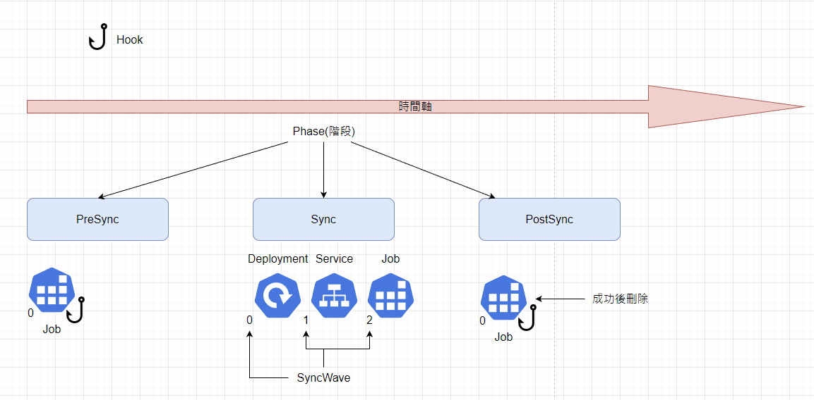
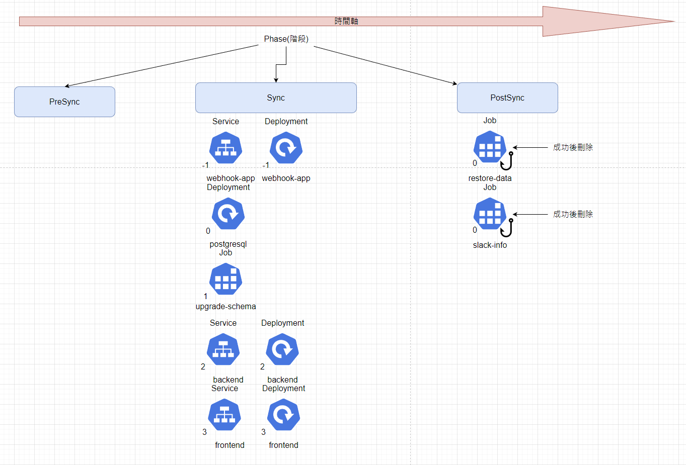

# Lab3 
1. 理解 Sync Hook
2. 理解 Sync Waves
3. 應用 Sync Hook 和 Waves
2. 使用此 [Repo](https://github.com/CCH0124/helm-charts/tree/master/kubernetes-api) 的 Helm Chart
4. 驗證

## Sync Hook 和 Waves
### Sync Hook
ArgoCD 再同步聲明週期中可以搭配掛鉤(Hook)資源。可用於同步前、期間或後，同步操作為失敗或是成功也可執行掛鉤。官方至當前 2.11.5 版本定義了以下掛鉤:
- PreSync
  - 在部署新版本應用程式前執行，場景像是執行 liquibase 等
- Sync
  - 在所有 PreSync 掛鉤完成並成功後執行，即同步應用程式期間執行，場景像是複雜的滾動更新策略，例如金絲雀發布等
- PostSync
  - 在同步操作之後觸發，場景象是執行整合監控或是執行整合測試的一些設計
- SyncFail
  - 在同步失敗之後觸發，場景象是清理數據、應用程式回滾
- Skip
  - 指示 Argo CD 要跳過的應用，用在當需要手動步驟來部署應用程式時
- PostDelete 
  - 使用 PostDelete 鉤子在所有應用程式資源刪除後執行清理或一些邏輯。即在刪除所有應用程式資源後執行

使用方式是使用 `argocd.argoproj.io/hook` 註解來完成，掛鉤可以是任何類型的 Kubernetes 資源類型，通常是 Pod、Job 或 Argo Workflows 等等。

>選擇性的同步期間不會觸發掛鉤

建立了鉤子後，任務也許會完成或失敗，資源並不會被移除，但最後要如何對鉤子做後續動作 ? 而官方提供以下策略，應用上是使用 `argocd.argoproj.io/hook-delete-policy` 註解:

- HookSucceeded
  - 掛鉤成功後，其資源將被移除
- HookFailed
  - 鉤子失敗後，其資源將被移除
- BeforeHookCreation
  - 預設策略
  - 此資源將在建立新資源之前被刪除，在觸發新的同步時。

在 ArgoCD 中上面的掛鉤是一個階段(phase)的概念。其也可以搭配 `argocd.argoproj.io/sync-wave` 的註解，來實現更複雜的應用。

### Sync waves

上面提到，ArgoCD 有多個階段執行同步的步驟，階段可以定義成 `preSync`、`sync` 和 `postSync` 等。假設，需要兩個輪流運行的 `PreSync` 作業怎麼辦 ? 對於 ArgoCD 來說提供的 `waves`，每個階段可以有一個或多個 `waves`，這可以用於控制應用程式資源在同步過程中的順序。簡而言之，`waves` 是命令 ArgoCD 如何應用 Git 儲存庫中 YAML 檔案在階段內部署的順序，進行依賴關係管理。`waves` 使用方式是使用 `argocd.argoproj.io/sync-wave` 註解來完成。

ArgoCD 會依照以下優先順序對資源進行排序

- 依據定義的掛鉤(階段)
- 較低的值首先用於創建和更新，較高的值首先用於刪除
- 依據 Kubernetes 的 `kind` 資源
- 依據名稱

預設情況下，所有 YAML 檔案的 `waves` 為 0。

總體可以使用下面這張圖簡易表示



[ArgoCD | sync-phases-and-waves ](https://argo-cd.readthedocs.io/en/stable/user-guide/sync-waves/#sync-phases-and-waves)

## 範例

範例資源於本作者 Github 上 [K8s-with-quarkus](https://github.com/CCH0124/K8s-with-quarkus/tree/v0.0.3/argocd-sample/sync-hook-wave)。範例時序圖，如下



建置環境會有一個 webhook，用於蒐集部署軟體的訊息；一個 backend 後端服務；一個 frontend 前端服務；一個 postgresql 資料庫服務，並搭配資料表初始化和資料復原等流程。最終從 webhook 服務的日誌可以看到觸發的順序，日誌如下，由於 webhook 的 `wave` 權重是 -1，比預設值 0 還低，因此他會先被建置。

```bash
hook: sync-wave 0, postgresql deployment.
2024-07-28 08:38:34,264 INFO  [com.cch.WebhookResource] (executor-thread-0) ===================================================
2024-07-28 08:38:41,492 INFO  [com.cch.WebhookResource] (executor-thread-0)  {}
2024-07-28 08:38:41,492 INFO  [com.cch.WebhookResource] (executor-thread-0) ===================================================
hook: wave 1 and pre-sync, upgrade-schema
2024-07-28 08:38:41,492 INFO  [com.cch.WebhookResource] (executor-thread-0) ===================================================
2024-07-28 08:38:56,441 INFO  [com.cch.WebhookResource] (executor-thread-0)  {}
2024-07-28 08:38:56,441 INFO  [com.cch.WebhookResource] (executor-thread-0) ===================================================
hook: sync-wave 2, backend deployment.
2024-07-28 08:38:56,441 INFO  [com.cch.WebhookResource] (executor-thread-0) ===================================================
2024-07-28 08:39:03,689 INFO  [com.cch.WebhookResource] (executor-thread-0)  {}
2024-07-28 08:39:03,689 INFO  [com.cch.WebhookResource] (executor-thread-0) ===================================================
hook: sync-wave 3, frontend deployment.
2024-07-28 08:39:03,689 INFO  [com.cch.WebhookResource] (executor-thread-0) ===================================================
2024-07-28 08:39:11,150 INFO  [com.cch.WebhookResource] (executor-thread-0)  {}
2024-07-28 08:39:11,150 INFO  [com.cch.WebhookResource] (executor-thread-0) ===================================================
hook: wave 1 PostSync, restore-data
2024-07-28 08:39:11,150 INFO  [com.cch.WebhookResource] (executor-thread-0) ===================================================
2024-07-28 08:39:34,268 INFO  [com.cch.WebhookResource] (executor-thread-0)  {}
2024-07-28 08:39:34,268 INFO  [com.cch.WebhookResource] (executor-thread-0) ===================================================
hook: PostSync, send notification
2024-07-28 08:39:34,268 INFO  [com.cch.WebhookResource] (executor-thread-0) ===================================================
```

從日誌來看，`wave` 為 0 的 postgresql 服務接續在 webhook 後被建置，接續是 `wave` 為 1 的 upgrade-schema 資源被建立，用於同步資料表，再來是 `wave` 為 2 的 backend 和 `wave` 為 3 的 frontend 服務被建置。最後觸發 `PostSync` 階段的 restore-data 和 slack-info `Job` 資源，可以看到它們會依照 `wave` 大小來執行，因此 restore-data 被處理完才是 slack-info，下面顯示了兩者定義的 YAML 檔案。這表明鉤子(階段)的優先權會大於 `wave`，鉤子是相同則辨別 `wave`，當 `wave` 又相同，則看 Kubernetes 資源。從 `wave` 為 2 的 backend 來說，其 `Service` 和 `Deployment` 資源鉤子是 `sync`，且 `wave` 都為 2，因此最後部署是由 Kubernetes 資源的優先順序來部署，所以先是 `Service` 再來才是 `Deployment`。


```yaml
---
apiVersion: batch/v1
kind: Job
metadata:
  name: restore-data
  annotations:
    argocd.argoproj.io/hook: PostSync
    argocd.argoproj.io/hook-delete-policy: HookSucceeded
  namespace: team-a
spec:
...
---
apiVersion: batch/v1
kind: Job
metadata:
  name: slack-info
  annotations:
    argocd.argoproj.io/hook: PostSync
    argocd.argoproj.io/sync-wave: "1"
    argocd.argoproj.io/hook-delete-policy: HookSucceeded
  namespace: team-a
...

```

以上面 `restore-data` 和 `slack-info` 在考慮帶有鉤子的 `wave` 時，需要注意的重要一點是 `wave` 是在每個鉤子中捕獲的。


要執行以上，會先建立一個 `Application` 如下，同時在 team-a-project 的 `AppProject` 新增 `Job` 資源權限。Application 相關配置資源於於本作者 Github 的 [argocd-gitops-manifest](https://github.com/CCH0124/argocd-gitops-manifest/blob/v0.0.3/developer/team-a/application/sync-wave-app.yaml)。

```yaml
# /developer/team-a/application/sync-wave-app.yaml
apiVersion: argoproj.io/v1alpha1
kind: Application
metadata:
  name: sync-wave-app
  namespace: argo
  finalizers:
    - resources-finalizer.argocd.argoproj.io
  labels:
    name: sync-wave-app
    environment: dev
spec:
  project: team-a-project
  source:
    repoURL: https://github.com/CCH0124/K8s-with-quarkus.git
    targetRevision: v0.0.3
    path: argocd-sample/sync-hook-wave
    directory:
      recurse: true
      include: '{*.yaml,*.yml}'
  destination:
    name: k3d-dev-cluster
    namespace: team-a
  # Sync policy
  syncPolicy:
    automated:
      prune: true
      selfHeal: true
      allowEmpty: false
    syncOptions:  
    - Validate=true
    - CreateNamespace=true
    - ApplyOutOfSyncOnly=true
    managedNamespaceMetadata:
      labels:
        env: dev
      annotations:
        team: team-a
        manage-by: argocd
    retry:
      limit: 5
      backoff:
        duration: 5s
        factor: 2
        maxDuration: 3m
```

```yaml
# /developer/team-a/project/project.yaml
apiVersion: argoproj.io/v1alpha1
kind: AppProject
metadata:
  name: team-a-project
  namespace: argo
  # Finalizer that ensures that project is not deleted until it is not referenced by any application
  finalizers:
    - resources-finalizer.argocd.argoproj.io
spec:
  description: Project for team-a
  sourceRepos:
  - https://github.com/CCH0124/K8s-with-quarkus.git
  destinations:
  - namespace: team-a
    name: stage-cluster
  - namespace: team-a
    name: k3d-dev-cluster
  clusterResourceWhitelist:
  - group: ''
    kind: Namespace
  namespaceResourceWhitelist:
  - group: 'apps'
    kind: Deployment
  - group: 'apps'
    kind: ReplicaSet
  - group: '*'
    kind: ServiceAccount
  - group: '*'
    kind: Service
  - group: '*'
    kind: Pod
  - group: 'batch'
    kind: Job
  permitOnlyProjectScopedClusters: false
```

```yaml
# developer/team-a/repositorie/repo.yaml
apiVersion: v1
kind: Secret
metadata:
  name: team-a-repo
  namespace: argo
  labels:
    argocd.argoproj.io/secret-type: repository
stringData:
  type: git
  url: https://github.com/CCH0124/K8s-with-quarkus.git
```

## 結論

ArgoCD 提供了 `hook` 與 `wave` 功能，這讓開發者或是管理者能夠對於部署夠複雜的系統有一個好的控制權。這使得管理針對專案建置順序或是專案整個生命週期，會有更彈性的應用。