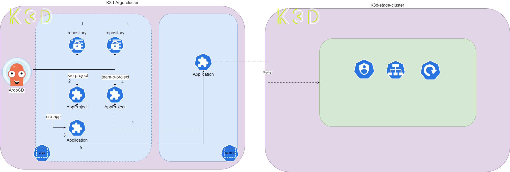

## Application in any namespace

原則目標是要讓 Argo CD 能夠管理其它 `namespace` 下的 `Application` 資源。對於 Argo CD 管理員可以定義特定的 `namespace` 資源，並可以在其中建立、更新和協調 `Application` 資源。管理員建立 `Application` 資源時會綁定 `AppProject` 資源，如果要應用那些特定的 `namespace` 則需要管理員配置到 `AppProject`。

這帶來好處，使得內部應用程式團隊能夠使用宣告式方式管理 Application 資源、或是實現 app-of-apps 等功能。確保不會因使用超出授予團隊權限的其它 `AppProject` 而面臨提權風險。

要達到上面描述的功能需要配置兩個物件

1. 使用 `--application-namespaces` 參數啟用。此參數控制 Argo CD 可允許獲取 `Application` 資源的 `namespace` 列表。不存在於列表都不能從任何 `AppProject` 中使用。白話一點是這個參數就像是 Argo CD 的一個「白名單」。可以在這個白名單上列出一些命名空間，告訴 Argo CD：「只有這些命名空間裡的 `Application`，你才能去管理它們。」如果一個命名空間沒有被列在這個白名單上， 就表示 Argo CD 認為這個命名空間裡的應用程式不在它的管轄範圍內，所以它就不會去管理這些應用程式。這央可以增加系統的安全性，防止未經授權的 `Application` 被管理

2. `Application` 的 `.spec.project` 所引用的 `AppProject` 必須在其 `.spec.sourceNamespaces` 字段中列出。如果 `Application` 指定了不允許的 `AppProject`，Argo CD 將拒絕處理該 `Application`。

`--application-namespaces` 使用逗號分隔的 `namespace` 列表，用於控管 `Application` 資源。預設上 Argo CD 從 `argocd-cmd-params-cm` 的 ConfigMap 資源也可達到同樣效果，如下配置，該配置可以使用 `*` 關鍵字。
 
```yaml
data:
  application.namespaces: team-a, team-b
```

在本次實驗使用以下配置，表示 team-a、team-b 可來管理 `Application` 資源
```yaml
configs:
  cm:
...
  params:
    # -- Enables [Applications in any namespace]
    application.namespaces: team-*
```

開啟此參數後，還希望其他 `namespace` 中的 `Application` 由 Argo CD API(CLI/UI) 管理，需要將 argocd-server `ServiceAccount` 資源的 Kubernetes RBAC 擴張權限。為了在 Argo CD 服務所屬 `namespace` 之外創建 `Application`，當中 `.spec.project` 中所引用的 `AppProject` 必須在 `AppProject.spec.sourceNamespaces` 中包含 `Application` 要隸屬的 `namespace`。下面演示一個範例

首先定義一個 `AppProject` 資源如下。

```yaml
apiVersion: argoproj.io/v1alpha1
kind: AppProject
metadata:
  name: team-b-project
  namespace: argo
  # Finalizer that ensures that project is not deleted until it is not referenced by any application
  finalizers:
    - resources-finalizer.argocd.argoproj.io
spec:
  description: Project for team-b
  sourceRepos:
  - https://github.com/CCH0124/K8s-with-quarkus.git
  - https://github.com/CCH0124/helm-charts.git
  destinations:
  - namespace: team-b
    name: stage-cluster
  - namespace: team-b
    name: k3d-dev-cluster
  clusterResourceWhitelist:
  - group: ''
    kind: Namespace
  namespaceResourceWhitelist:
  - group: 'apps'
    kind: Deployment
  - group: 'apps'
    kind: ReplicaSet
  - group: '*'
    kind: ServiceAccount
  - group: '*'
    kind: Service
  - group: '*'
    kind: Pod
  - group: 'batch'
    kind: Job
  permitOnlyProjectScopedClusters: false
```

定義 `Application` 資源如下，此時 `namespace` 指向 team-b，`.spec.project` 指向 `team-b-project`。主要確保 `.spec.project` 欄位引用允許 `Application` 所要的命名空間。

```yaml
apiVersion: argoproj.io/v1alpha1
kind: Application
metadata:
  name: simple-app-any-ns
  namespace: team-b
  labels:
    name: simple-app-any-ns
    environment: stage
spec:
  project: team-b-project
  source:
    repoURL: https://github.com/CCH0124/K8s-with-quarkus.git
    targetRevision: v0.0.6
    path: application-simple/simple-app/kubernetes
    directory:
      recurse: true
      exclude: '*.json'
      include: '{*.yaml,*.yml}'
  destination:
    name: stage-cluster
    namespace: team-b
  # Sync policy
  syncPolicy:
    automated:
      prune: true
      selfHeal: true
      allowEmpty: false
    syncOptions:  
    - Validate=false
    - CreateNamespace=true
    - ApplyOutOfSyncOnly=true
    managedNamespaceMetadata:
      labels:
        env: stage
      annotations:
        team: team-b
        manage-by: argocd
    retry:
      limit: 5
      backoff:
        duration: 5s
        factor: 2
        maxDuration: 3m
```

最後出現了以下的錯誤，其原因是對於 `AppProject` 並沒有允許 team-b 的 `namespace` 建置 `Application`。

```bash
Unable to load data: app is not allowed in project "team-b-project", or the project does not exist
```

修正這錯誤是將 `AppProject` 加入 `.spec.sourceNamespaces[0]: team-b`，讓其允許。

```yaml
apiVersion: argoproj.io/v1alpha1
kind: AppProject
metadata:
  name: team-b-project
  namespace: argo
  finalizers:
    - resources-finalizer.argocd.argoproj.io
spec:
  description: Project for team-b
...
  sourceNamespaces:
  - team-b
  permitOnlyProjectScopedClusters: false
```

透過指令，可發現 simple-app-any-ns 資源被建置在 team-b 的 `namespace`，其格式是 `<namespace>/<name>` 即 `team-b/simple-app-any-ns`。

```bash
$ argocd app list
NAME                                     CLUSTER                         NAMESPACE  PROJECT              STATUS   HEALTH   SYNCPOLICY  CONDITIONS        REPO                                                   PATH                                                         TARGET
argo/argocd                              https://kubernetes.default.svc  argo       third-party-project  Synced   Healthy  Auto-Prune  <none>            https://argoproj.github.io/argo-helm                                                                                7.1.3
argo/k3d-dev-cluster-ingress-controller  https://172.18.0.6:6443         ingress    sre-project          Synced   Healthy  Auto-Prune  <none>            https://kubernetes.github.io/
...
team-b/simple-app-any-ns                 stage-cluster                   team-b     team-b-project       Synced   Healthy  Auto-Prune  <none>            https://github.com/CCH0124/K8s-with-quarkus.git        application-simple/simple-app/kubernetes                     v0.0.6
argo/sre-app                             https://kubernetes.default.svc  argo       sre-project          Synced   Healthy  Auto-Prune  <none>            https://github.com/CCH0124/argocd-gitops-manifest.git  .                                                            v0.0.6
...
```

到這可以彙整成以下架構，對於此架構來說，透過 sre-app 的 `Application` 資源對 sre-project、team-b-project 和 repository 資源透過 Argo CD 進行同步，其中第 5 步驟將 `Application` 即上述範例 simple-app-any-ns 部署至 team-b 的 `namespace`，這個部署則是被 team-a-project 允許。




`Application` 有了 `namespace` 概念後，對於 RBAC 的設定同樣的會多一層 `namespace`，這樣可以完成更細力度的權限授權。假設有一個開發員叫 devuser，由於被換部門至 team-b 其同時需要在 team-a 做交接和在 team-b 上進行開發，因此將授予 team-a 讀的權限，並給予 team-b 編輯或更新等權限，下面是針對 devuser 的配置。


```yaml
...
            policy.csv: |
                p, role:dev, applications, get,  team-a-project/simple-app, allow
                p, role:dev, applications, *,  team-b-project/team-b/*, allow
                p, role:dev, projects, get,  team-a-project, allow
                p, role:dev, repositories, get,  *, allow
                p, role:dev, clusters, get,  *, allow
                g, devuser, role:dev
```

透過 `can-i` 驗證，確實對於 team-a 的相關資源無法進行更新操作，但對於 team-b 是可以，其對應權限是 `p, role:dev, applications, *,  team-b-project/team-b/*, allow`，即對 team-b-project 允許的 team-b 下所有 Application 資源都可進行任何操作。

```bash
$ argocd account can-i sync applications 'team-a-project/simple-app'
no
$ argocd account can-i sync applications 'team-a-project/sync-wave-app'
no
$ argocd account can-i sync applications 'team-b-project/simple-app-any-ns'
no
$ argocd account can-i sync applications 'team-b-project/team-b/simple-app-any-ns'
yes
$ argocd account can-i get applications 'team-b-project/team-b/simple-app-any-ns'
yes
$ argocd account can-i get applications 'team-a-project/sync-wave-app'
yes
```

## 結論

在不同 `namespace` 建置 `Application` 資源是從版本 2.5 開始。此重點在於細粒度的資源控管和不同架構上的應用，如果 Argo CD 使用一個 Kubernetes 集群管理且是維運人員負責所有相關資源配置，則此模式大可不必使用，有點畫蛇添足，上述範例就是如此。但，如果某些功能像是通知、`Application` 建置規畫由開發人員進行配置且 Argo CD 服務和開發團隊的資源屬於同一個 Kubernetes 集群內，則此模式可以進行更好的權限控管。

