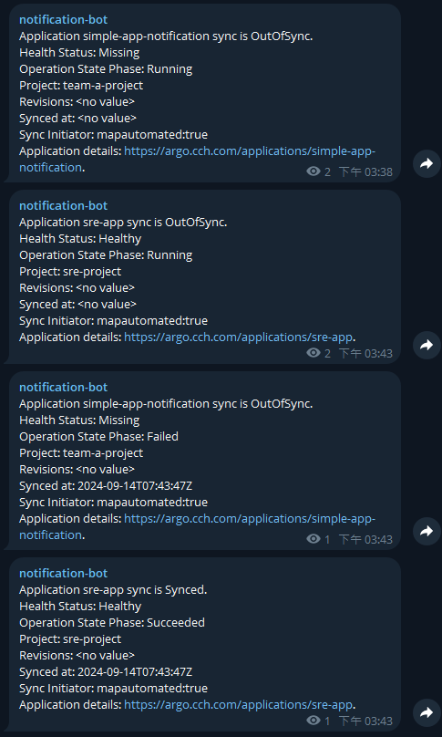

1. 定義 triggers
2. 定義 templates
3. 定義 Subscriptions
4. 使用 Telegram 接收通知


Argo CD 通知會持續監控 Argo CD 應用程式，並提供靈活的方式通知使用者應用程式狀態的重要變化。使用靈活的觸發器(trigger)和模板(template)，可制定何時發送通知以及定義通知內容。

## Ttiggers

定義應發送通知的條件。該定義包括觸發器名稱、條件和參照的通知模板。可以在 `argocd-notifications-cm` 的 `ConfigMap` 如下定義，不同階段觸發條件都有對應的模板參考，而模板是可以多個。

```yaml
...
    trigger.on-deployed: |
      - when: app.status.operationState.phase in ['Succeeded'] and app.status.health.status == 'Healthy' # trigger condition
        oncePer: app.status.sync.revision
        send: [tg-template] # template name
    trigger.on-sync-status-error: |
      - when: app.status.operationState.phase in ['Error', 'Failed'] # trigger condition
        send: [tg-template] # template name
    trigger.on-sync-status-running: |
      - when: app.status.operationState.phase in ['Running'] # trigger condition
        oncePer: app.status.sync.revision
        send: [tg-template] # template name
    trigger.on-sync-status-unknown: |
      - when: app.status.sync.status == 'Unknown' # trigger condition
        send: [app-sync-status]  # template name
```

通知會有重複發送的情況，被訊息大量淹沒導致管理上感覺很煩厭，因此可以透過 `oncePer` 欄位。明白地說，應用程式運行狀況可能會間歇性地切換為正在處理 `Progressing`，然後切換回 `Healthy`，因此觸發器可能會產生多個通知。藉由 `oncePer`，可以指定僅當對應的應用程式欄位發生變更時才產生通知，上面範例針對，git commit 資訊來控制。

另外如果是使用 Mono Repo 方式管理多個應用程式，透過 `app.status.sync.revision` 不切實際，官方建議使用 `app.status.operationState.syncResult.revision`。那只有這些嗎 ? 不其還可以引用 `Application` 資源上的 `annotations` 進行設定。


## template

通知模板目的是產生通知內容，並定義在 argocd-notifications-cm `ConfigMap` 中。該模板可重複使用，並且可以由多個觸發器(trigger)引用。

在模板中可以引用 argocd-notifications-cm 中 `context` 欄位，該欄位可以是存放共用資訊的欄位，像是環境、哪個地理位置之類，並讓模板可以引用參考。

另外也可以引用 `secret` 資源。該 `secret` 資源預設必須是引用 `argocd-notifications-secret` 的。語法上只要 `.secret.{SECRET_DATA_NAME}`。

進階一點的話，還提供一些[函式](https://argo-cd.readthedocs.io/en/stable/operator-manual/notifications/functions/)進行更高階的應用，像是獲取 commit、author 等資訊。下面提供範本

```yaml
    template.tg-template: |
      message: |
        Application {{.app.metadata.name}} sync is {{.app.status.sync.status}}.
        Health Status: {{.app.status.health.status}}
        Operation State Phase: {{.app.status.operationState.phase}}
        Project: {{.app.spec.project}}
        Revisions: {{.app.status.sync.revisions}}
        Synced at: {{.app.status.operationState.finishedAt}}
        Sync Initiator: {{.app.status.operationState.operation.initiatedBy}}
        Application details: {{.context.argocdUrl}}/applications/{{.app.metadata.name}}.
    template.on-sync-status-unknown: |
      message: |
        Author: {{(call .repo.GetCommitMetadata .app.status.sync.revision).Author}}
        Commit Message: {{(call .repo.GetCommitMetadata .app.status.sync.revision).Message }}
```

## Subscriptions

最後一個步驟，使用 `notification.argoproj.io/subscribe.<trigger>.<service>: <recipient>` 註解定義 Argo CD 應用程式事件的訂閱。

範例如下

```yaml
# devops/first/application.yaml
apiVersion: argoproj.io/v1alpha1
kind: Application
metadata:
  name: sre-app
  namespace: argo
  finalizers:
    - resources-finalizer.argocd.argoproj.io
  labels:
    name: sre-app
    team: sre
  annotations:
    notifications.argoproj.io/subscribe.on-deployed.telegram: "-1002435691214"
    notifications.argoproj.io/subscribe.on-sync-status-running.telegram: "-1002435691214"
    notifications.argoproj.io/subscribe.on-sync-status-error.telegram: "-1002435691214"
    notifications.argoproj.io/subscribe.on-sync-status-unknown: "-1002435691214"
spec:
  project: sre-project
  source:
    repoURL: https://github.com/CCH0124/argocd-gitops-manifest.git
...
```

`annotations` 由以下部分組成，

- on-deployed
    - 觸發器名稱
- telegram
    - 通知服務名稱
- -1002435691214
    - 以分號分隔的接收通知列表

上面解釋了 Argo CD 通知較重要元件。這通知預設上會安裝，在 Helm Chart 上也是啟用，因此透過 `get pods` 可以看到該服務。啟用的同時間會產生 `argocd-notifications-cm` 和 `argocd-notifications-secret` 兩個資源，前者為 `ConfigMap` 後者為 `Secret`。

```yaml
notifications:
  enabled: true # 預設是啟用
  ...
  argocdUrl: "" # 建議配置
...
```

```bash
$ kubectl -n argo get pods
NAME                                                        READY   STATUS      RESTARTS         AGE
...
argo-cd-argocd-notifications-controller-77bbb5664d-t4hlv    1/1     Running     7 (6h52m ago)    48d
...
```

也就是所有通知觸發的結果可從該 `Pod` 日誌進行查看，如下。

```bash
$  kubectl -n argo logs -f --tail 100 -f argo-cd-argocd-notifications-controller-77bbb5664d-t4hlv
{"level":"info","msg":"Processing completed","resource":"argo/simple-app","time":"2024-09-14T07:52:46Z"}
{"level":"info","msg":"Start processing","resource":"argo/stage-cluster-team-b","time":"2024-09-14T07:52:46Z"}
{"level":"info","msg":"Processing completed","resource":"argo/stage-cluster-team-b","time":"2024-09-14T07:52:46Z"}
{"level":"info","msg":"Start processing","resource":"team-b/simple-app-any-ns","time":"2024-09-14T07:52:46Z"}
{"level":"info","msg":"Processing completed","resource":"team-b/simple-app-any-ns","time":"2024-09-14T07:52:46Z"}
{"level":"info","msg":"Start processing","resource":"argo/sre-app","time":"2024-09-14T07:52:47Z"}
{"level":"info","msg":"Trigger on-deployed result: [{[0].y7b5sbwa2Q329JYH755peeq-fBs b12af722f181081bc30e3395a1e3c491d72beb6d [tg-template] true}]","resource":"argo/sre-app","time":"2024-09-14T07:52:47Z"}
{"level":"info","msg":"Notification about condition 'on-deployed.[0].y7b5sbwa2Q329JYH755peeq-fBs' already sent to '{telegram -1002435691214}' using the configuration in namespace argo","resource":"argo/sre-app","time":"2024-09-14T07:52:47Z"}
{"level":"info","msg":"Trigger on-sync-status-error result: [{[0].H9WjsqG1dKYm6njOZ7yUQYOA1Wk  [tg-template] false}]","resource":"argo/sre-app","time":"2024-09-14T07:52:47Z"}
{"level":"info","msg":"Trigger on-sync-status-running result: [{[0].xGlbhcF_taGYrI3UsrQsINn2hl0  [tg-template] false}]","resource":"argo/sre-app","time":"2024-09-14T07:52:47Z"}
{"level":"info","msg":"Processing completed","resource":"argo/sre-app","time":"2024-09-14T07:52:47Z"}
{"level":"info","msg":"Start processing","resource":"argo/sre-app","time":"2024-09-14T07:52:47Z"}
{"level":"info","msg":"Trigger on-deployed result: [{[0].y7b5sbwa2Q329JYH755peeq-fBs b12af722f181081bc30e3395a1e3c491d72beb6d [tg-template] true}]","resource":"argo/sre-app","time":"2024-09-14T07:52:47Z"}
{"level":"info","msg":"Notification about condition 'on-deployed.[0].y7b5sbwa2Q329JYH755peeq-fBs' already sent to '{telegram -1002435691214}' using the configuration in namespace argo","resource":"argo/sre-app","time":"2024-09-14T07:52:47Z"}
{"level":"info","msg":"Trigger on-sync-status-error result: [{[0].H9WjsqG1dKYm6njOZ7yUQYOA1Wk  [tg-template] false}]","resource":"argo/sre-app","time":"2024-09-14T07:52:47Z"}
{"level":"info","msg":"Trigger on-sync-status-running result: [{[0].xGlbhcF_taGYrI3UsrQsINn2hl0  [tg-template] false}]","resource":"argo/sre-app","time":"2024-09-14T07:52:47Z"}
{"level":"info","msg":"Processing completed","resource":"argo/sre-app","time":"2024-09-14T07:52:47Z"}
{"level":"info","msg":"Start processing","resource":"argo/sre-app","time":"2024-09-14T07:52:48Z"}
{"level":"info","msg":"Trigger on-sync-status-running result: [{[0].xGlbhcF_taGYrI3UsrQsINn2hl0  [tg-template] false}]","resource":"argo/sre-app","time":"2024-09-14T07:52:48Z"}
{"level":"info","msg":"Trigger on-deployed result: [{[0].y7b5sbwa2Q329JYH755peeq-fBs b12af722f181081bc30e3395a1e3c491d72beb6d [tg-template] true}]","resource":"argo/sre-app","time":"2024-09-14T07:52:48Z"}
{"level":"info","msg":"Notification about condition 'on-deployed.[0].y7b5sbwa2Q329JYH755peeq-fBs' already sent to '{telegram -1002435691214}' using the configuration in namespace argo","resource":"argo/sre-app","time":"2024-09-14T07:52:48Z"}
{"level":"info","msg":"Trigger on-sync-status-error result: [{[0].H9WjsqG1dKYm6njOZ7yUQYOA1Wk  [tg-template] false}]","resource":"argo/sre-app","time":"2024-09-14T07:52:48Z"}
{"level":"info","msg":"Processing completed","resource":"argo/sre-app","time":"2024-09-14T07:52:48Z"}
```

而上面的 triggers、templates 和 Subscriptions 要被定義至 `argocd-notifications-cm` ConfigMap 資源中，如下。

```yaml
apiVersion: v1
data:
  context: |
    argocdUrl: https://argo.cch.com
  service.telegram: |
    token: $telegram-token
  template.on-sync-status-unknown: |
    message: |
      Author: {{(call .repo.GetCommitMetadata .app.status.sync.revision).Author}}
      Commit Message: {{(call .repo.GetCommitMetadata .app.status.sync.revision).Message }}
  template.tg-template: |
    message: |
      Application {{.app.metadata.name}} sync is {{.app.status.sync.status}}.
      Health Status: {{.app.status.health.status}}
      Operation State Phase: {{.app.status.operationState.phase}}
      Project: {{.app.spec.project}}
      Revisions: {{.app.status.sync.revisions}}
      Synced at: {{.app.status.operationState.finishedAt}}
      Sync Initiator: {{.app.status.operationState.operation.initiatedBy}}
      Application details: {{.context.argocdUrl}}/applications/{{.app.metadata.name}}.
  trigger.on-deployed: |
    - when: app.status.operationState.phase in ['Succeeded'] and app.status.health.status == 'Healthy'
      oncePer: app.status.sync.revision
      send: [tg-template]
  trigger.on-sync-status-error: |
    - when: app.status.operationState.phase in ['Error', 'Failed']
      send: [tg-template]
  trigger.on-sync-status-running: |
    - when: app.status.operationState.phase in ['Running'] # trigger condition
      oncePer: app.status.sync.revision
      send: [tg-template] # template name
  trigger.on-sync-status-unknown: |
    - when: app.status.sync.status == 'Unknown'
      oncePer: app.status.sync.revision
      send: [app-sync-status]
kind: ConfigMap
metadata:
...
  labels:
    app.kubernetes.io/component: notifications-controller
    app.kubernetes.io/instance: argo-cd
    app.kubernetes.io/managed-by: Helm
    app.kubernetes.io/name: argocd-notifications-controller
    app.kubernetes.io/part-of: argocd
    app.kubernetes.io/version: v2.11.3
    argocd.argoproj.io/instance: argocd
    helm.sh/chart: argo-cd-7.1.3
  name: argocd-notifications-cm
  namespace: argo
  resourceVersion: "187361"
  uid: b6e4e78b-570a-4da0-816a-8a4cf9891ae6
```

這當中 `service.telegram` 未提到，基本上是定義接收通知服務，可以這樣定義 `service.<SERVICE_NAME>`，而 `token: $telegram-token` 是定義對該服務存取時要的令牌或是 apiKey 等，`$telegram-token` 會對應至 `argocd-notifications-secret` `Secret` 資源中的 `data` 欄位鍵值。

`template.on-sync-status-unknown` 定義是 `template.<TEMPLATE_NAME>`，觸發器的 `send` 欄位會參照至該 `<TEMPLATE_NAME>`。

`trigger.on-deployed` 定義是 `template.<TRIGGER_NAME>`。更細節部分是，`send` 會對應 template 所定義的名稱，上一階段義了 template.on-sync-status-unknown 此格式的 on-sync-status-unknown 就是該 template 名稱。`when` 則是觸發條件，只要 Application `Sync` 狀態是 `Unknown` 皆會發送至訂閱的收訊者。

`context` 可用來定義共用的資訊或是而外訊息內容。

當這些資源被部署後，在 Telegram 可以看到以下接收的訊息，這樣就可以對團隊進行通知了。




除此之外，裡面的 `{{}}` 的內容是參照 Application 資源所定義的 CRD 欄位。以範例來說想獲取 Application 的名稱，就透過 `{{ .app.metadata.name }}` 進行獲取。可以如何知道那些字段 ? 可透過 `explain` 方式，定義這些欄位是對專案有用處。

```bash
s$ kubectl explain Application.status
GROUP:      argoproj.io
KIND:       Application
VERSION:    v1alpha1

FIELD: status <Object>

DESCRIPTION:
    ApplicationStatus contains status information for the application

FIELDS:
  conditions    <[]Object>
    Conditions is a list of currently observed application conditions

  controllerNamespace   <string>
    ControllerNamespace indicates the namespace in which the application
    controller is located

  health        <Object>
    Health contains information about the application's current health status

  history       <[]Object>
    History contains information about the application's sync history

  observedAt    <string>
    ObservedAt indicates when the application state was updated without querying
    latest git state Deprecated: controller no longer updates ObservedAt field

  operationState        <Object>
    OperationState contains information about any ongoing operations, such as a
    sync

  reconciledAt  <string>
    ReconciledAt indicates when the application state was reconciled using the
    latest git version

  resourceHealthSource  <string>
    ResourceHealthSource indicates where the resource health status is stored:
    inline if not set or appTree

  resources     <[]Object>
    Resources is a list of Kubernetes resources managed by this application

  sourceType    <string>
    SourceType specifies the type of this application

  sourceTypes   <[]string>
    SourceTypes specifies the type of the sources included in the application

  summary       <Object>
    Summary contains a list of URLs and container images used by this
    application

  sync  <Object>
    Sync contains information about the application's current sync status
```

對於 `ApplicationSet` 能設定嗎 ? 當然可以，但定義也是在 `Application` 資源上。

```yaml
apiVersion: argoproj.io/v1alpha1
kind: ApplicationSet
metadata:
  name: git-generator-app
  namespace: argo
spec:
  goTemplate: true
  goTemplateOptions: ["missingkey=error"]
  generators:
  - matrix:
      generators:
      - clusters: 
          selector:
            matchExpressions:
              - key: env
                operator: In
                values:
                  - dev
                  - stage
                  - prd
          values:
            env: '{{index .metadata.annotations "env"}}' 
      - git:
          repoURL: https://github.com/CCH0124/helm-charts.git
          revision: argo-appset
          directories:
          - path: charts/*
  template:
    metadata:
      name: '{{.path.basename}}-{{.values.env}}'
      annotations:
        notifications.argoproj.io/subscribe.on-deployed.telegram: "-1002435691214"
        notifications.argoproj.io/subscribe.on-sync-status-running.telegram: "-1002435691214"
        notifications.argoproj.io/subscribe.on-sync-status-error.telegram: "-1002435691214"
        notifications.argoproj.io/subscribe.on-sync-status-unknown: "-1002435691214"
...
```

## 總結

可以知道要讓 Argo CD 能夠做到通知，需針對 `argocd-notifications-cm`、`argocd-notifications-secret` 與 ``Application` 資源進行配置。

而通知要設定以下
- service
- template
- trigger
- subscription

最後有幾個點值得思考 

1. 失敗與成功發送訊息的目標角色是 SRE/DevOps 還是 Developer ? 平台又分別要什麼? 
2. template 內容要放置什麼有意義訊息