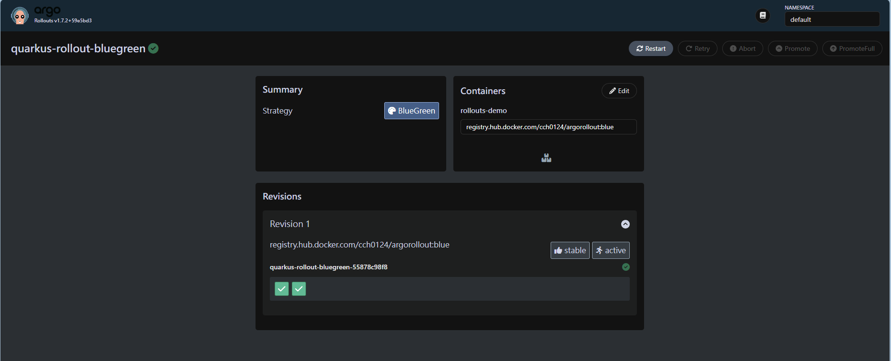

Argo Rollout 是持續逐步交付部署到 Kubernetes 的解決方案。它可以實現藍綠和金絲雀等部署來提高部署可靠性和效能。使用藍綠和金絲雀部署等持續逐步交付將流量轉移到新的應用程式版本，而不是立即切換所有請求。能夠限制因部署損壞而造成的損害，因為目的只先為一小部分用戶提供新版本服務。Argo Rollout 是一個 CRD 資源，其允許定義更高階部署的方案，現有 Kubernetes 的策略只能達到 Rolling update 和 Recreate 策略。


當 Rollout 資源部署至 Kubernetes 時，Argo 控制器會偵測到它的存在，接著根據需要建立、取代和刪除 Pod。後續接著可以使用 Argo 的 Kubectl 外掛來管理部署，例如向更多使用者公開新部署或啟動回滾。這些操作也可以根據外部來源提供的資料自動執行，例如，Ingress 控制器的 HTTP 請求指標或 service mesh 的網路流量分析。Argo Rollout 也彌補了 Kubernetes 在部署上面的豐富程度。

## 應用程式發布策略

1. Blue-Green

Argo Rollouts 中提供的藍綠部署啟動新版本的 Pod，但不會將任何流量導向它們。舊版本（藍色）仍然有效並繼續為您的生產用戶提供服務。開發人員可以手動測試新版本（綠色）以驗證其正常運作。

 

FROM https://argoproj.github.io/argo-rollouts/concepts/

2. Canary 

金絲雀部署啟動新版本並使用它來處理一部分即時流量。可以藉由逐漸增加新版本所提供的流量，以便在太多用戶遇到問題之前檢測到並解決任何問題。

 

FROM https://argoproj.github.io/argo-rollouts/concepts/


3. Rolling Update

更新期間會啟動新版本服務的 Pod，然後逐漸縮小舊部署的規模，直到只剩下新版本服務部署運行。預設 Kubernetes 使用此模式，避免 `Recreate` 帶來的停機時間。

4. Recreate 

此策略會從 Kubernetes 中刪除舊部署，然後啟動新版本並立即將其公開給流量。但舊部署停止和新部署啟動之間的時間間隙，會發生一些停機時間。


## Argo Rollouts 部署流程

基本上核心流程是

1. 部署新版本服務
2. 測試新版本

藍綠部署面相由開發人員完成，而金絲雀部署一小部分真實用戶進行測試，當對金絲雀部署導流的結果有一定結論時，可以增加定向到新版本的流量比例。

3. 全面部署

一旦確定部署成功，就將其層級推至全面部署。Argo Rollouts 將刪除舊部署並確保所有流量都定向到新部署。此時團隊可以開始迭代下一個更改，並準備重複此循環。

4. 自動回滾

透過外部系統產生的指標，例如 Prometheus 中的請求延遲或異常資料在發生時，自動回滾。

## Argo Rollouts Install

使用 Helm chart 安裝 argo-rollouts

```bash
$ helm repo add argo https://argoproj.github.io/argo-helm
$ helm install argo-rollout argo/argo-rollouts
```

安裝 CLI，以方便觀看變化
```bash
curl -LO https://github.com/argoproj/argo-rollouts/releases/latest/download/kubectl-argo-rollouts-linux-amd64
chmod +x ./kubectl-argo-rollouts-linux-amd64
sudo mv ./kubectl-argo-rollouts-linux-amd64 /usr/local/bin/kubectl-argo-rollouts
kubectl argo rollouts version
```

透過 `kubectl argo rollouts dashboard` 開啟儀錶板。

```bash
$ kubectl argo rollouts dashboard
INFO[0000] Argo Rollouts Dashboard is now available at http://localhost:3100/rollouts
INFO[0000] [core] [Channel #1 SubChannel #2] grpc: addrConn.createTransport failed to connect to {Addr: "0.0.0.0:3100", ServerName: "0.0.0.0:3100", }. Err: connection error: desc = "transport: Error while dialing: dial tcp 0.0.0.0:3100: connect: connection refused"
```

## 藍綠部署

### 定義 Rollout CRD

```yaml
apiVersion: argoproj.io/v1alpha1
kind: Rollout
metadata:
  name: quarkus-rollout-bluegreen
spec:
  replicas: 2
  revisionHistoryLimit: 2
  selector:
    matchLabels:
      app: quarkus-rollout-bluegreen
  template:
    metadata:
      labels:
        app: quarkus-rollout-bluegreen
    spec:
      containers:
      - name: rollouts-demo
        image: registry.hub.docker.com/cch0124/argorollout:blue
        imagePullPolicy: Always
        ports:
        - containerPort: 8080
  strategy:
    blueGreen:
      # activeService specifies the service to update with the new template hash at time of promotion.
      # This field is mandatory for the blueGreen update strategy.
      activeService: quarkus-rollout-bluegreen-active
      # previewService specifies the service to update with the new template hash before promotion.
      # This allows the preview stack to be reachable without serving production traffic.
      # This field is optional.
      previewService: quarkus-rollout-bluegreen-preview
      # autoPromotionEnabled disables automated promotion of the new stack by pausing the rollout
      # immediately before the promotion. If omitted, the default behavior is to promote the new
      # stack as soon as the ReplicaSet are completely ready/available.
      # Rollouts can be resumed using: `kubectl argo rollouts promote ROLLOUT`
      autoPromotionEnabled: false
```

`strategy` 使用 `blueGreen`。因為欄位需要兩個 `service` 資源所以要定義

1. activeService 當前使用的 `Service` 資源的名稱（blue）。
2. previewService 新版本的 `Service` 資源名稱（green）。

另外 `autoPromotionEnabled` 表示是否自動切換，如果成功，自動將綠色服務提升為可對外使用之服務。`Rollout.spec.template` 定義基本上是和 `Deployment` 資源相同。

更多的定義內容可以參閱官方[bluegreen](https://argoproj.github.io/argo-rollouts/features/bluegreen/) 文件。

定義兩個 Service 資源，分別給藍和綠

```yaml
kind: Service
apiVersion: v1
metadata:
  name: quarkus-rollout-bluegreen-active
spec:
  selector:
    app: quarkus-rollout-bluegreen
  ports:
  - protocol: TCP
    port: 8080
    targetPort: 8080
---
kind: Service
apiVersion: v1
metadata:
  name: quarkus-rollout-bluegreen-preview
spec:
  selector:
    app: quarkus-rollout-bluegreen
  ports:
  - protocol: TCP
    port: 8080
    targetPort: 8080
```

為了方便看效果，定義一個 Ingress 資源

```yaml
apiVersion: networking.k8s.io/v1
kind: Ingress
metadata:
  name: quarkus-rollout-bluegreen
spec:
  ingressClassName: nginx
  rules:
  - http:
      paths:
      - path: /
        pathType: Prefix
        backend:
          service:
            name: quarkus-rollout-bluegreen-active
            port:
              number: 8080
```

此時將上面資源進行 `kubectl apply` 部署至 Kubernetes 上。此時 Argo rollouts 儀錶板會有一個 `quarkus-rollout-bluegreen` 的資源。



透過指令方式可以看到以下結果，當中 `INFO` 欄位表示該服務目前是使用中。

```bash
$ kubectl argo rollouts get rollouts quarkus-rollout-bluegreen -w
Name:            quarkus-rollout-bluegreen
Namespace:       default
Status:          ✔ Healthy
Strategy:        BlueGreen
Images:          registry.hub.docker.com/cch0124/argorollout:blue (stable, active)
Replicas:
  Desired:       2
  Current:       2
  Updated:       2
  Ready:         2
  Available:     2

NAME                                                   KIND        STATUS     AGE  INFO
⟳ quarkus-rollout-bluegreen                            Rollout     ✔ Healthy  27m
└──# revision:1
   └──⧉ quarkus-rollout-bluegreen-55878c98f8           ReplicaSet  ✔ Healthy  23m  stable,active
      ├──□ quarkus-rollout-bluegreen-55878c98f8-cbrgn  Pod         ✔ Running  23m  ready:1/1
      └──□ quarkus-rollout-bluegreen-55878c98f8-s24lh  Pod         ✔ Running  23m  ready:1/1
```

此時 curl 結果是最新版本

```bash
$ curl http://dev.cch.com:8081/hello
Hello RESTEasy hello
```

而預設上 Service 資源，當下的第一次都是抓相同的 Pod 資源。

```bash
$ kubectl get service -o wide
NAME                                TYPE        CLUSTER-IP      EXTERNAL-IP   PORT(S)    AGE   SELECTOR
kubernetes                          ClusterIP   10.43.0.1       <none>        443/TCP    28d   <none>
quarkus-rollout-bluegreen-preview   ClusterIP   10.43.157.153   <none>        8080/TCP   40m   app=quarkus-rollout-bluegreen,rollouts-pod-template-hash=55878c98f8
quarkus-rollout-bluegreen-active    ClusterIP   10.43.206.30    <none>        8080/TCP   40m   app=quarkus-rollout-bluegreen,rollouts-pod-template-hash=55878c98f8
```
 
此時更新一個新開發的版本。透過，`argo rollouts set image` 方式

```bash
$ kubectl argo rollouts set image quarkus-rollout-bluegreen rollouts-demo=registry.hub.docker.com/cch0124/argorollout:green
```

我們可以看到，新增了一個 `preview`，`INFO` 欄位中 `preview` 可表示是一個需要被驗證才可對外使用的服務。


```bash
Name:            quarkus-rollout-bluegreen
Namespace:       default
Status:          ॥ Paused
Message:         BlueGreenPause
Strategy:        BlueGreen
Images:          registry.hub.docker.com/cch0124/argorollout:blue (stable, active)
                 registry.hub.docker.com/cch0124/argorollout:green (preview)
Replicas:
  Desired:       2
  Current:       4
  Updated:       2
  Ready:         2
  Available:     2

NAME                                                   KIND        STATUS     AGE  INFO
⟳ quarkus-rollout-bluegreen                            Rollout     ॥ Paused   44m
├──# revision:2
│  └──⧉ quarkus-rollout-bluegreen-8489bcffd9           ReplicaSet  ✔ Healthy  51s  preview
│     ├──□ quarkus-rollout-bluegreen-8489bcffd9-swzjb  Pod         ✔ Running  51s  ready:1/1
│     └──□ quarkus-rollout-bluegreen-8489bcffd9-whmzd  Pod         ✔ Running  51s  ready:1/1
└──# revision:1
   └──⧉ quarkus-rollout-bluegreen-55878c98f8           ReplicaSet  ✔ Healthy  41m  stable,active
      ├──□ quarkus-rollout-bluegreen-55878c98f8-cbrgn  Pod         ✔ Running  41m  ready:1/1
      └──□ quarkus-rollout-bluegreen-55878c98f8-s24lh  Pod         ✔ Running  41m  ready:1/1
```

而這個 `preview` 可以拿來進行測試與驗證

```bash
$ curl dev.cch.com:8081/preview/hello # preview
Hello RESTEasy hello-rollout
$ curl dev.cch.com:8081/hello # user using
Hello RESTEasy hello
```

當驗證完，可以進行切換透過以下方式

```bash
$ kubectl argo rollouts promote quarkus-rollout-bluegreen
rollout 'quarkus-rollout-bluegreen' promoted
```

從

```bash
Name:            quarkus-rollout-bluegreen
Namespace:       default
Status:          ✔ Healthy
Strategy:        BlueGreen
Images:          registry.hub.docker.com/cch0124/argorollout:green (stable, active)
Replicas:
  Desired:       2
  Current:       2
  Updated:       2
  Ready:         2
  Available:     2

NAME                                                   KIND        STATUS         AGE    INFO
⟳ quarkus-rollout-bluegreen                            Rollout     ✔ Healthy      50m
├──# revision:2
│  └──⧉ quarkus-rollout-bluegreen-8489bcffd9           ReplicaSet  ✔ Healthy      5m54s  stable,active
│     ├──□ quarkus-rollout-bluegreen-8489bcffd9-swzjb  Pod         ✔ Running      5m54s  ready:1/1
│     └──□ quarkus-rollout-bluegreen-8489bcffd9-whmzd  Pod         ✔ Running      5m54s  ready:1/1
└──# revision:1
   └──⧉ quarkus-rollout-bluegreen-55878c98f8           ReplicaSet  • ScaledDown   46m
      ├──□ quarkus-rollout-bluegreen-55878c98f8-cbrgn  Pod         ◌ Terminating  46m    ready:0/1
      └──□ quarkus-rollout-bluegreen-55878c98f8-s24lh  Pod         ◌ Terminating  46m    ready:1/1
```

最後逐漸變成下面，在 `scaleDownDelaySeconds` 之後，Argo Rollouts 將縮小第一版本 `replicaSet`。當然這沒有完全刪除資源，而是有保留 `replicaSet` 資源以方便回滾。

```bash
Name:            quarkus-rollout-bluegreen
Namespace:       default
Status:          ✔ Healthy
Strategy:        BlueGreen
Images:          registry.hub.docker.com/cch0124/argorollout:green (stable, active)
Replicas:
  Desired:       2
  Current:       2
  Updated:       2
  Ready:         2
  Available:     2

NAME                                                   KIND        STATUS        AGE   INFO
⟳ quarkus-rollout-bluegreen                            Rollout     ✔ Healthy     51m
├──# revision:2
│  └──⧉ quarkus-rollout-bluegreen-8489bcffd9           ReplicaSet  ✔ Healthy     7m3s  stable,active
│     ├──□ quarkus-rollout-bluegreen-8489bcffd9-swzjb  Pod         ✔ Running     7m3s  ready:1/1
│     └──□ quarkus-rollout-bluegreen-8489bcffd9-whmzd  Pod         ✔ Running     7m3s  ready:1/1
└──# revision:1
   └──⧉ quarkus-rollout-bluegreen-55878c98f8           ReplicaSet  • ScaledDown  47m 
```
對應的儀錶板


此時使用端可以訪問新版本。

```bash
$ curl dev.cch.com:8081/hello
Hello RESTEasy hello-rollout
```

假設版本上發現了一些錯誤，則可以進行退版，可使用 `undo` 方式並指定退版版本。但使用此方式，會違反 GitOps 核心概念，因此會較建議使用 `git revert` 等方式進行回滾，以保持一致。

```bash
$ kubectl argo rollouts undo quarkus-rollout-bluegreen --to-revision 1
$ kubectl argo rollouts promote quarkus-rollout-bluegreen
```

最後確實也退版了。

```bash
$ curl dev.cch.com:8081/hello
Hello RESTEasy hello
```

假設是一個已經部署很久的服務，想要實現藍綠部署，對於上面作法需要宣告一個類似 `Deployment` 的資訊至 `Rollout` CRD 上。如果要更簡單的使用可以使用 `workloadRef` 來參照 `Deployment` 資源，如下。

```yaml
apiVersion: argoproj.io/v1alpha1
kind: Rollout
metadata:
  name: quarkus-rollout-bluegreen
spec:
  replicas: 2
  revisionHistoryLimit: 2
  selector:
    matchLabels:
      app.kubernetes.io/version: blue
      app.kubernetes.io/name: argorollout
  workloadRef: 
    apiVersion: apps/v1
    kind: Deployment
    name: argorollout
    # Specifies if the workload (Deployment) is scaled down after migrating to Rollout.
    # The possible options are:
    # "never": the Deployment is not scaled down
    # "onsuccess": the Deployment is scaled down after the Rollout becomes healthy
    # "progressively": as the Rollout is scaled up the Deployment is scaled down
    # If the Rollout fails the Deployment will be scaled back up.
    scaleDown: onsuccess
  strategy:
    blueGreen:
      # activeService specifies the service to update with the new template hash at time of promotion.
      # This field is mandatory for the blueGreen update strategy.
      activeService: quarkus-rollout-bluegreen-active
      # previewService specifies the service to update with the new template hash before promotion.
      # This allows the preview stack to be reachable without serving production traffic.
      # This field is optional.
      previewService: quarkus-rollout-bluegreen-preview
      # autoPromotionEnabled disables automated promotion of the new stack by pausing the rollout
      # immediately before the promotion. If omitted, the default behavior is to promote the new
      # stack as soon as the ReplicaSet are completely ready/available.
      # Rollouts can be resumed using: `kubectl argo rollouts promote ROLLOUT`
      autoPromotionEnabled: false
```

## 結論

上述內容，可以協助理解藍綠部署的目的以及配置方式。相較於 Kubernetes 原生資源是達不到更豐富的部署，因此透過 Argo rollouts 的框架可以輕鬆實現更高階部署。當然官方提供更多的像是流量管理、分析等配置讓我們可以更多彈性的驅動部署。